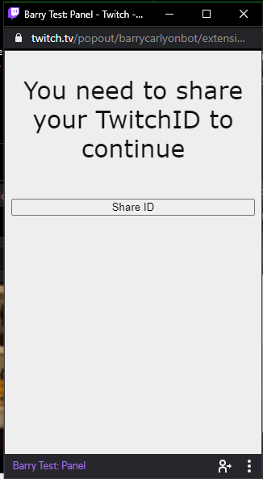
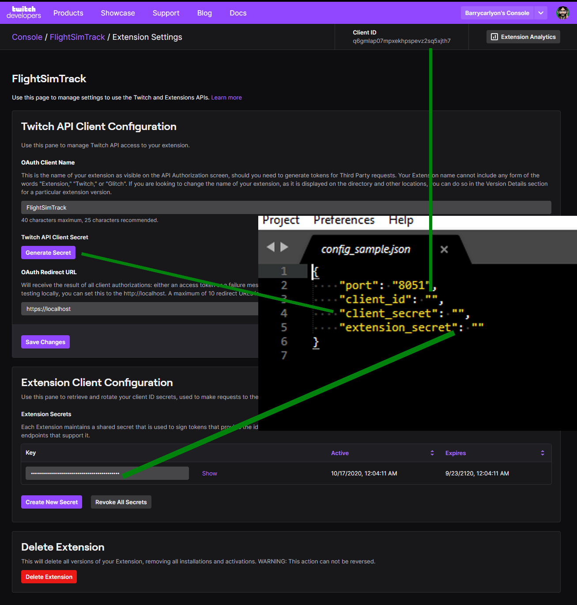

# Whats in this Repo

This Repo provides a simple example of a Twitch Extension.

The Example EBS is written in NodeJS

This Twitch Extension primarilly demonstrates the following

### Front End

- Theme Switching based on the Twitch Theme toggle
- Prompting a user to Share their Twitch ID with the Extenion
- Making a call to a EBS and display the result

### Back End

A Twitch Extension Back end is also known as an "EBS" or "Extension Backend Service"

- Generating an App Access Token for the EBS to use
- Parsing a JWT Token that was passed up from the front end
- Calling the Twitch API from the EBS

### What this extension doesn't do is cover SSL hosting. EITHER FOR TESTING OR YOUR EBS

### Example Images

## Getting Started.

This covers how to get started if you don't already have an extension setup.

If you already do you can just use your existing hosting/test solution and use the existing Extension. And follow from step 12 for the relevant keys/IDs/secrets

1. Visit the Twitch Dev Console to create a new extension. [Link](https://dev.twitch.tv/console/extensions/create)
1. Give it a Name, you cannot use "Extension," "Twitch," or "Glitch". Hit Continue
1. Select the Panel checkbox, leave the reset as is. Hit Create
1. Select `Capabilities` at the top
1. Select `Yes, I would like my extension to request an identity link.` and `Save Changes`
1. Select `Asset Hosting` at the top
1. Change `Panel Viewer Path` to `index.html`
1. Change the `Panel Height` to 500 and `Save Changes`
1. Top right hit `Extension Settings`
1. In the ebs folder copy `config_sample.json` to `config.json`
1. Change the port as need
1. Copy the clientID from this page, it's at the top, into the `""`  of `client_id` in `config.json`
1. Under `Twitch API Client Secret` Click on `Generate Secret`
1. Hit OK
1. Copy the now shown Client Secret into the `""` of `client_secret` in `config.json`
1. Under "Extension Secrets" on the page hit the "show" button
1. Copy the now shown key (including any = on the end) into the `""` of `extension_secret` in `config.json`
1. Run by `cd` to your ebs folder and run the commands
1. `npm install`
1. `node .`
1. In extension copy `config_sample.js` to `config.js`
1. Change the `https://theURLtoMyEBS` to the URL of your now running EBS

For easy what key goes where see

FINALLY

Install the Extension to your channel and test it.

## Notes

These instructions do not cover SSL termination, which is the only gotcha here.

You can use something like [NGROK](https://ngrok.com/) for testing.

You'd need two tunnels, one for your frontend and one for your backend (or if you know what you are doing just the one). And to adjsut the Extension Console settings (and config.json's) as needed

## GOTCHAS

**The EBS for this server, generates an App Access Token at Boot, but doesn't test it/renew it. So if you use this code for a production EBS it'll probably stop working after 60 days. The EBS is for short demonstrations of the code flow.**
